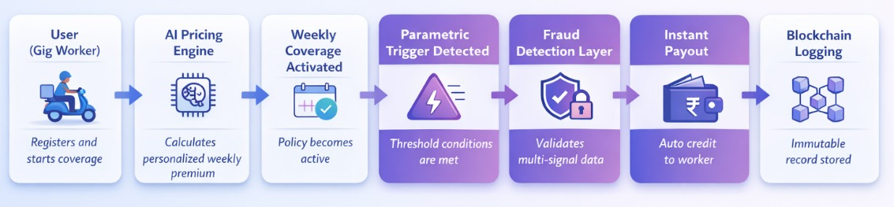
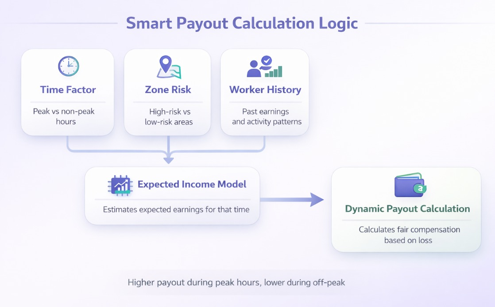
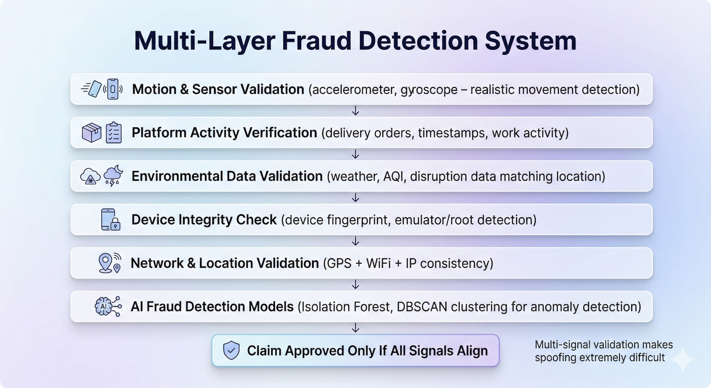

<div align="center">
  
</div>

# KuberaAI - Trustless Parametric Insurance for India's Gig Economy

---

## The Problem

India's gig delivery workforce - riders on Zomato, Swiggy, Zepto, Amazon, and similar platforms - are the backbone of urban last-mile logistics. Yet they operate with **zero income safety net**.

When disruptions hit - extreme rainfall, dangerous AQI levels, heatwaves, or zone curfews - these workers lose **20–30% of their weekly income** overnight. Through no fault of their own. With no recourse.

There is currently **no income protection mechanism** designed for this segment. Traditional insurance is either:
- Too slow (days to weeks for claim processing)
- Too complex (proof-of-loss documentation, agent visits)
- Too expensive (annual premiums misaligned with weekly gig income)

---

## What KuberaAI Does

KuberaAI is a **fully automated, AI + blockchain-powered parametric insurance platform** purpose-built for gig workers.

Instead of covering assets, it protects **income** - the only thing that truly matters to a delivery rider.

**Core promise:**
- Weekly premium model aligned with gig income cycles
- Zero-touch claims — no paperwork, no filing, no waiting
- Instant payouts triggered by verified real-world disruptions
- Fraud-resistant by design
- Trustless payout execution via smart contracts

---

## How It Works

### End-to-End Flow



```
Worker Registers
       ↓
AI Engine Calculates Weekly Premium (personalized)
       ↓
Worker Subscribes
       ↓
System Continuously Monitors Disruptions (Weather APIs, AQI, Traffic, Curfews)
       ↓
Trigger Condition Met (e.g., rainfall > threshold, AQI > 300)
       ↓
Fraud Validation Layer Executes
       ↓
Smart Contract Auto-Triggers Payout
       ↓
Claim Logged Immutably on Blockchain
```

### Parametric Triggers

Unlike traditional insurance, KuberaAI does not require workers to *prove* they were affected. Payouts are triggered automatically when objective, measurable thresholds are crossed:

| Trigger Type | Example Condition |
|---|---|
| Rainfall Intensity | > 50mm/hr in worker's zone |
| Heat Index | > 42°C for sustained hours |
| Air Quality Index | > 300 (Hazardous) |
| Zone Shutdown / Curfew | Official order detected |

---

## AI-Powered Risk & Pricing Engine



Premiums are not one-size-fits-all. The AI engine personalizes pricing using:

- **Historical weather patterns** for the worker's active zones
- **Worker activity data** (hours active, zones covered, delivery density)
- **Zone-based disruption probability scores**

This ensures fairness - a rider in flood-prone Mumbai pays a different premium than one in arid Jaipur.

---

## How KuberaAI Fights Fraud

### The Threat: GPS Spoofing Syndicates

Parametric systems face a critical vulnerability: if payouts are triggered by location + disruption data, bad actors can **spoof GPS signals** and fake presence in a disruption zone to collect fraudulent payouts at scale.

KuberaAI treats this as a **first-class adversarial threat** - not an afterthought.

### Adversarial Defense Strategy - The Core Answer

#### 1. Threat Model: Coordinated GPS Spoofing Attacks

The market scenario presents a realistic threat:
- **500+ coordinated fraudsters** organized via Telegram and other secure channels
- **Attack vector**: Bulk GPS spoofing tools combined with fake delivery app activity
- **Goal**: Trigger mass payouts by faking presence in high-disruption zones
- **Exploitation window**: During real disruptions (floods, heat waves) when noise is high
- **Systemic risk**: Liquidity pool drained via simultaneous coordinated payouts

KuberaAI is engineered specifically to detect and survive this attack pattern.

#### 2. Differentiation Engine: How We Detect Real vs. Fake

**KuberaAI's core insight**: A genuine claim requires alignment across *multiple independent systems*.

A claim is considered valid only when:
1. **Physical motion matches delivery behavior** - Accelerometer + Gyroscope show realistic movement patterns
2. **Platform activity confirms work** - Orders are accepted, completed, and timestamped in delivery app
3. **Environmental conditions align** - Worker's location, weather, AQI match expected disruption zone
4. **Temporal physics are obeyed** - No teleportation between zones; velocity consistent with real riding
5. **No coordinated anomaly is detected** - DBSCAN clustering doesn't flag the worker as part of a syndicate

**Why this works:** Spoofing requires synchronizing multiple independent systems simultaneously.
- A fraudster can fake GPS ✓
- Faking GPS + motion sensors is exponentially harder ✓
- Faking GPS + motion + platform activity + environmental data + device integrity is practically impossible ✓

**Final Decision Rule**: A claim is approved only when independent signals across motion, behavior, environment, and network all converge. Any inconsistency triggers progressive validation instead of immediate rejection.

This transforms fraud from a low-cost exploit into a high-complexity, economically unviable attack.

#### 3. Data Beyond GPS: Explicit Data Categories

KuberaAI analyzes multiple independent data streams beyond GPS:

| Data Category | Source | Purpose |
|---|---|---|
| **Motion data** | Accelerometer, Gyroscope | Validate realistic delivery riding patterns |
| **Network data** | WiFi access points, cell tower triangulation (IP-based geo-validation) | Cross-validate GPS coordinates |
| **Platform data** | Delivery app (orders, timestamps, zones, completion status) | Confirm worker actually completed work |
| **Environmental data** | Weather APIs, AQI databases | Match claimed location to real disruption zones |
| **Device integrity** | Device fingerprinting, root/emulator detection | Prevent spoofing via compromised devices |
| **Behavioral history** | Past work patterns, movement patterns, usual zones | Detect unauthorized geographic expansion |
| **Session consistency** | IP address, device ID, browser session tracking | Ensure claims from expected user context |
| **Crowd intelligence** | Clustered claim patterns, DBSCAN analysis | Detect syndicate rings before payout |

#### 4. UX Balance: Fairness Under Uncertainty

KuberaAI follows a **fairness-first approach** that protects genuine workers even during high-fraud scenarios:

- **No instant rejection** - Suspicious claims are delayed for validation, not rejected outright
- **Lightweight revalidation** - Workers can confirm presence via OTP, in-app check-in, or simple device confirmation (< 5 minutes)
- **Network resilience** - Failures during severe weather are treated as valid edge cases, not fraud signals
- **Transparent decision-making** - Workers see exactly why claims are held and what evidence is needed to authorize
- **Micro-loans for delays** - Genuine workers under review receive bridge funding to prevent economic hardship
- **Automatic escalation** - If validation fails, claims move to manual review with worker notification

**Outcome**: The system errs toward trust while gathering evidence. False positives are minimized through multi-layered validation rather than automated rejection.

---

### Multi-Layer Defense Architecture (Implementation Layer)



#### Layer 1 - Multi-Sensor Fusion (Beyond GPS)

GPS alone is easily spoofed. KuberaAI cross-validates location using:

- **Accelerometer** - Is the device actually moving like a delivery rider would?
- **Gyroscope** - Are motion patterns consistent with real-world riding?
- **Network triangulation** - Do Wi-Fi access points and cell towers agree with GPS?
- **Environmental correlation signals** (where available) - Pressure, humidity, and light levels can optionally validate environmental conditions match the claimed disruption zone. During rainfall or heat events, these signals provide additional consistency checks.

A fraudster can fake a GPS coordinate. Faking motion sensors + network signals + platform data simultaneously is exponentially harder.

#### Layer 2 — Platform Behavioral Signals & Pattern Anchoring

- Are orders being accepted and completed on the delivery app?
- Is the worker spending time in active delivery zones?
- Is activity consistent with typical work patterns?
- **Work Shift Coherence** - Sudden geographic pivots are suspicious. If a worker's claimed location is 50km from their usual work zones, require higher confidence levels.
- **Sleep Pattern Validation** - At 3 AM, a sudden payout claim from a worker who normally sleeps is flagged (unless there's prior emergency shift history).
- **Peer-zone Activity Correlation** - Legitimate delivery workers typically operate in consistent geographic clusters. If a worker suddenly claims disruption in a zone where none of their historical activity occurs, flag it for additional validation.

A genuine worker has a trail of consistent platform activity across time and space. A fraud actor impersonating one or running automated scripts does not.

#### Layer 3 - Environmental Cross-Validation & Public Data Oracles

- Does the volume of claims from a zone match the actual disruption severity?
- Are claims clustering in statistically anomalous ways?
- **Third-Party Data Validation**: Cross-validate with independent public data sources:
  - **Weather APIs** (rainfall, AQI, temperature) from government meteorological agencies
  - **Public disruption reports** (news, social media, traffic apps showing slowdowns)
  - **Geographic claim volume correlation** - If a real disruption occurred, independent reports should exist (news, weather alerts, traffic data)
- **Temporal anomaly detection** - Claims arriving in tight temporal windows from the same zone are cross-checked against independent disruption confirmation

Fraud rings that trigger mass fake payouts leave detectable statistical fingerprints that contradict real-world environmental data.

#### Layer 4 — Device Integrity Checks & Session Validation

- **Device fingerprinting** to detect account duplication and detect multiple claims from same device
- **Emulator and rooted device detection** (common tools for GPS spoofing)
- **Detection of synthetic identities** (unusual signup patterns, inconsistent user data)
- **Session consistency validation** - Verify claims come from same IP, device, and browser context (unexpected device switches = suspicious)
- **User re-validation for suspicious claims** - OTP or in-app confirmation required for medium/high-risk claims
- **Manual audit triggers** - Claims from new devices or unusual locations are flagged for human review before payout

#### Layer 5 — AI Fraud Detection Models & Syndicate Ring Detection

| Model | Purpose |
|---|---|
| Isolation Forest | Detects individual outlier behavior |
| Sequence Models | Tracks behavioral patterns over time |
| DBSCAN Clustering | Identifies coordinated fraud rings by detecting groups of workers with statistically identical behavior patterns (real workers are diverse; syndicates are cloned) |

**Syndicate Quarantine Response**:
- Once a coordinated ring is detected, auto-trigger a "claim hold" mode (1-2 hours) on all members of the detected cluster
- Genuine workers in real disruption receive micro-loans (bridge funding) during hold period
- Fraudsters are incentivized to expose themselves by complaining or attempting workarounds

### Fairness-First Response (No False Positives) — Graduated Verification Tiers

The system is designed to **never penalize genuine workers** due to network glitches or edge cases:

| Risk Score | Action | Timeline |
|---|---|---|
| **Tier 1 — High Trust** | Auto-approve. Past 6+ months clean history + multi-sensor check = instant payout | Immediate (< 10 seconds) |
| **Tier 2 — Medium Trust** | Short delay + re-validation. New worker or unusual location = send OTP or in-app confirmation request | 10-30 minutes |
| **Tier 3 — Fraud Suspected** | Claim is held; worker receives SMS to confirm presence. Real workers respond within 5 min; bots do not. Manual audit triggered. | 30-120 minutes |

**Transparency Guarantee**: Workers receive full transparency on claim status, risk score breakdown, and the reason for any hold throughout the process. No claim is rejected without explainable evidence provided to the worker.

#### Layer 6 — Temporal Physics & Impossible Movement Detection

- **Velocity Validation**: Calculate velocity between consecutive GPS pings. A user cannot teleport 50km in 30 seconds. Any superluminal movement is flagged.
- **Geofence Coherence**: Before a claim triggers, verify the user's last known position was *actually entering* the disruption zone (not appearing inside it magically).
- **Temporal Clustering Analysis**: In syndicate scenarios, coordinated fake claims arrive simultaneously. Flag temporal spikes: "50 claims from Zone X in 2 minutes" is a red flag, even if individual claims pass location checks.
- **Movement History Coherence**: Track movement patterns over weeks. Sudden, unexplained changes in mobility patterns are flagged for deeper inspection.

#### Layer 7 — Immutable Claim Ledger & Payout Logging

- **Claim hash storage** - Each validated claim is hashed and stored on-chain, creating an immutable record
- **Payout logging** - All approved payouts are timestamped and logged on-chain for transparency and audit
- **Non-repudiation** - Workers and KuberaAI both have cryptographic proof of what claim was submitted and when
- **Future auditability** - If fraud is discovered post-payout, the immutable ledger provides evidence for the investigation

---

## System Resilience & Liquidity Protection

KuberaAI treats liquidity protection as a first-class system constraint, not just a financial outcome.

The market scenario tests one critical question: **Can your system survive a coordinated mass fraud attack without draining the liquidity pool?**

KuberaAI uses dynamic payout throttling to prevent systemic collapse:

### Payout Rate Limiting During Anomaly Spikes

**Scenario:** 500 coordinated fraudsters trigger 50 fake claims/minute during a real disruption.

**Defense:**

| Metric | Threshold | Action |
|--------|-----------|--------|
| **Claim spike rate** | > 3x historical average | Activate claim hold mode |
| **Cluster similarity score** | > 0.85 (DBSCAN) | Geo-cluster throttling |
| **Temporal concentration** | Same minute, same zone | Stagger payouts (5-min intervals) |
| **Risk score volatility** | Rapid state changes | Automatic manual audit trigger |

**Outcome:**
- Genuine claims still approved (within 30 min, with micro-loans if needed)
- Fraudulent claims queued and eventually rejected after validation
- Liquidity pool protected from simultaneous drain

### Geo-Cluster Throttling

When anomalous claim patterns are detected in a geographic zone:

1. **Detection**: DBSCAN identifies 50+ workers with statistically identical behavioral patterns
2. **Isolation**: Flag all members as **"under review"** state
3. **Verification**: Each claim in the cluster requires additional validation (SMS reconfirmation, device attestation)
4. **Bridge Funding**: Genuine workers receive micro-loans from reserve fund while under review (prevents hardship)
5. **Resolution**: Clean workers exit review in 1-2 hours; fraudsters remain flagged

**Result:** Slows down fraud rings (increases cost-to-attack) while protecting innocent workers.

### Delayed Payouts Under Coordinated Attack

During high-confidence syndicate attacks:

- **Tier 1 & 2 claims** (high trust): Still approve immediately (build trust in non-fraudsters)
- **Tier 3 claims** (suspicious): Delay 30-120 minutes + require SMS confirmation
- **System-wide stress**: If claim rate > 5x normal AND cluster anomalies detected, apply **global payout queue** (FIFO, 1 claim per 30 seconds)

This prevents liquidity exhaustion while maintaining fair treatment.

### Fraud Ring Isolation Strategy

**Phase 1 — Detection:**
- DBSCAN identifies statistically cloned workers
- Mark as "fraud suspected" (not "fraud confirmed" — fairness first)

**Phase 2 — Containment:**
- Temp block (48 hours) on mass payouts from the ring
- Allow individual revalidation
- Genuine workers can exit by providing additional proof (video check-in)

**Phase 3 — Recovery:**
- If ring is confirmed fraudulent, flag payouts for adjustment and block future claims from flagged accounts
- If innocent workers were mistakenly grouped, they receive compensation and full account restoration

---

## Security Architecture

KuberaAI is built on cybersecurity-grade principles:

- **Zero Trust Model** - No component trusts another by default
- **OWASP Top 10** compliance
- **AES-256** data encryption at rest
- **TLS 1.3** for all data in transit
- **JWT-based authentication** with role-based access control
- **Rate limiting + input validation** on all APIs
- **Real-time anomaly alerts** and full audit logs

---

## Blockchain Layer

Blockchain is used minimally and strategically — enabling transparency and immutability without overcomplication:

| Function | What It Does |
|---|---|
| **Claim logging** | Each approved claim is hashed and stored on-chain with timestamp |
| **Payout recording** | Final payouts are logged for complete audit trail |
| **Non-repudiation** | Cryptographic proof that a claim was submitted at a specific time |

**Key principle:** All intelligence (fraud detection, risk scoring, AI models) remains off-chain for scalability and control. Only final claim hashes and payment records go on-chain.

**Implementation:**
- Simple smart contract with `logClaim()` and `recordPayout()` functions
- Uses Polygon for low transaction costs
- No complex verification logic on-chain; validation happens off-chain

This ensures immutability and transparency without blockchain's complexity overhead.

### Piggybank - Micro-Savings Innovation

Workers can opt into a **Piggybank wallet** - a micro-savings buffer that auto-accumulates small amounts during normal weeks, providing an additional personal safety net during prolonged disruptions.

- Transparent transaction history
- Worker-controlled withdrawals
- Auto-pause during active disruption periods

---

## System Architecture

```
┌─────────────────────────────────────┐
│         OFF-CHAIN (Intelligence)    │
│                                     │
│  ┌──────────┐  ┌──────────────────┐ │
│  │ AI/ML    │  │ Fraud Detection  │ │
│  │ Engine   │  │ Engine           │ │
│  └──────────┘  └──────────────────┘ │
│  ┌──────────┐  ┌──────────────────┐ │
│  │Disruption│  │ User Dashboard   │ │
│  │ Monitor  │  │ (React)          │ │
│  └──────────┘  └──────────────────┘ │
└────────────────────┬────────────────┘
                     │ Validated Trigger
                     ▼
┌─────────────────────────────────────┐
│         ON-CHAIN (Trust Layer)      │
│                                     │
│  ┌──────────────────────────────┐   │
│  │  Smart Contracts (Solidity)  │   │
│  │  - Policy rules              │   │
│  │  - Trigger conditions        │   │
│  │  - Payout logic              │   │
│  └──────────────────────────────┘   │
│  ┌──────────────────────────────┐   │
│  │  Immutable Claim Ledger      │   │
│  │  - Claim hashes              │   │
│  │  - Validation proofs         │   │
│  │  - Timestamps                │   │
│  └──────────────────────────────┘   │
└─────────────────────────────────────┘
```

---

## 🛠️ Tech Stack

| Layer | Technology |
|---|---|
| Backend | Flask (Python) |
| Database | SQLite |
| AI/ML | Scikit-learn |
| Frontend | React |
| Blockchain | Polygon + Solidity |
| External APIs | Weather API, Mock Traffic Data |

---

## Who This Is For

Any worker in the Indian gig economy whose income is vulnerable to uncontrollable external disruptions:

- Food delivery riders (Zomato, Swiggy)
- E-commerce delivery partners (Amazon, Flipkart, Meesho)
- Quick-commerce riders (Zepto, Blinkit, Swiggy Instamart)

---

## Why It Matters

India has an estimated **15 million+ gig workers** in delivery alone, with the number growing every year. The lack of a financial safety net for this workforce is not just an individual problem - it's a systemic economic vulnerability.

KuberaAI is the first step toward a future where the gig economy's growth doesn't come at the cost of the workers powering it.

---

> *Built to protect those who deliver for everyone else.*
